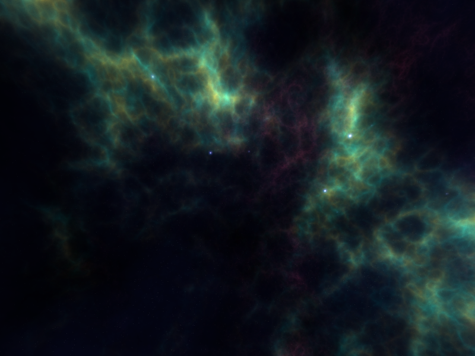

# SPACE ROCKS — a neon Asteroids remix (Python + Pygame)

A modernised take on the classic 1979 *Asteroids* arcade game, built with Python
and **pygame-ce**. Everything is drawn procedurally as glowing neon vectors —
no image assets required — with particle explosions, screen shake, an animated
starfield, power-ups, a hunting UFO, combo scoring, and three game modes.



## Features

- **Neon vector graphics** — procedurally rendered ship, jagged asteroids,
  bullets, UFO and power-ups with additive glow.
- **Juice** — particle explosions and thrust, screen shake, ship blink on
  respawn, twinkling parallax starfield with a soft nebula backdrop.
- **Three game modes**
  - **Classic** — clear every wave; each wave adds more, faster rocks. 3 lives.
  - **Survival** — endless rocks with steadily rising pressure. 3 lives.
  - **Time Attack** — 60 seconds, unlimited respawns, score as much as possible.
- **Scoring & combos** — a multiplier (up to x8) builds as you chain kills and
  decays if you stop. Small rocks are worth more than large ones.
- **Power-ups** (dropped by destroyed rocks / UFOs)
  - `R` Rapid fire · `S` Spread shot · `P` Shield (blocks one hit) · `L` Extra life
- **UFO enemy** — periodically flies in and fires aimed shots. Worth big points.
- **Extra lives** every 10,000 points (Classic / Survival).
- **Persistent high scores** per mode, saved to `highscores.json`.
- **Procedural sound effects** synthesised at runtime with numpy (auto-disables
  gracefully if audio isn't available).

## Controls

| Action | Keys |
| --- | --- |
| Rotate | ← / → or A / D |
| Thrust | ↑ or W |
| Shoot | Space (hold to auto-fire) |
| Hyperspace (risky teleport) | H |
| Pause | P or Esc |
| Mute | M |
| Menu: navigate / select | ↑ ↓ / Enter |
| Quit | Esc (from menu) |

## Run it

**Windows (easiest):** double-click **`run.bat`** — it creates the virtual
environment and installs dependencies on first run, then launches the game.

**Manual:**

```bash
python -m venv venv
venv\Scripts\activate        # Windows  (source venv/bin/activate on macOS/Linux)
pip install -r requirements.txt
python space_rocks/__main__.py
```

Requires Python 3.10+ (developed and tested on Python 3.14).

## Project structure

```
Asteroids-game/
├── space_rocks/
│   ├── __main__.py     # entry point
│   ├── game.py         # window, scene state machine, the three modes
│   ├── settings.py     # tunables, colours, paths
│   ├── entities.py     # Ship, Asteroid, Bullet, PowerUp, UFO
│   ├── particles.py    # additive particle system
│   ├── starfield.py    # animated background
│   ├── hud.py          # HUD + text rendering
│   ├── audio.py        # procedural sound effects (numpy)
│   ├── highscores.py   # per-mode high score persistence
│   └── utils.py        # geometry + procedural neon rendering
├── requirements.txt
├── run.bat
└── highscores.json     # created on first game over
```

## Dependencies

- [`pygame-ce`](https://pyga.me/) — the actively maintained community fork of
  pygame (drop-in replacement).
- `numpy` — optional, used only to synthesise sound effects.

## Credits

Inspired by the classic *Asteroids* (Atari, 1979). Built with Python 3 and
pygame-ce.
