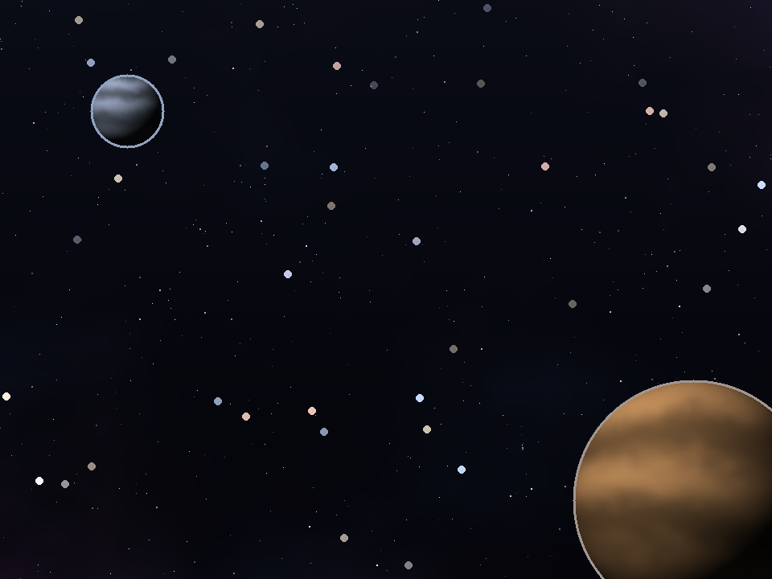

# SPACE ROCKS — a neon Asteroids remix (Python + Pygame)

A modernised take on the classic 1979 *Asteroids* arcade game, built with Python
and **pygame-ce**. Features realistic, procedurally-generated art — a shaded
metallic ship, an alien enemy fighter, 3D-lit cratered rock asteroids, and a
deep-space background with a dense starfield, a planet and a moon — plus
particle explosions, screen shake, power-ups, a hunting UFO, combo scoring,
and three game modes.



## Features

- **Realistic procedural art** — sprites are generated at runtime (with numpy
  lighting) and baked to `assets/sprites/`:
  - a shaded metallic interceptor with cockpit, wings and engine exhaust
  - a menacing alien enemy fighter
  - 3D-lit, cratered rock asteroids (four variants, three sizes)
  - a deep-space backdrop: dark gradient, multi-coloured starfield, a banded
    planet, a moon and a faint nebula
- **Juice** — particle explosions (rock dust + embers), thrust exhaust, screen
  shake, ship blink on respawn, drifting foreground stars.
- **Three game modes**
  - **Classic** — clear every wave; each wave adds more, faster rocks. 3 lives.
  - **Survival** — endless rocks with steadily rising pressure. 3 lives.
  - **Time Attack** — 60 seconds, unlimited respawns, score as much as possible.
- **Scoring & combos** — a multiplier (up to x8) builds as you chain kills and
  decays if you stop. Small rocks are worth more than large ones.
- **Power-ups** (dropped by destroyed rocks / UFOs)
  - `R` Rapid fire · `S` Spread shot · `P` Shield (blocks one hit) · `L` Extra life
- **UFO enemy** — periodically flies in and fires aimed shots. Worth big points.
- **Extra lives** every 10,000 points (Classic / Survival).
- **Persistent high scores** per mode, saved to `highscores.json`.
- **Procedural sound effects** synthesised at runtime with numpy (auto-disables
  gracefully if audio isn't available).

## Controls

| Action | Keys |
| --- | --- |
| Rotate | ← / → or A / D |
| Thrust | ↑ or W |
| Shoot | Space (hold to auto-fire) |
| Hyperspace (risky teleport) | H |
| Pause | P or Esc |
| Mute | M |
| Menu: navigate / select | ↑ ↓ / Enter |
| Quit | Esc (from menu) |

## Run it

**Windows (easiest):** double-click **`run.bat`** — it creates the virtual
environment and installs dependencies on first run, then launches the game.

**Manual:**

```bash
python -m venv venv
venv\Scripts\activate        # Windows  (source venv/bin/activate on macOS/Linux)
pip install -r requirements.txt
python space_rocks/__main__.py
```

Requires Python 3.10+ (developed and tested on Python 3.14).

On first launch the game generates its sprites into `assets/sprites/` (this
takes a moment); subsequent launches load the cached PNGs.

## Custom art

Every sprite is a plain PNG in `assets/sprites/`, so you can replace any of them
with your own art and the game will use yours automatically:

| File | What it is |
| --- | --- |
| `ship.png` | player ship (nose pointing up) |
| `enemy.png` | enemy fighter (nose pointing down) |
| `asteroid_0.png` … `asteroid_3.png` | asteroid variants |
| `background.png` | full-screen space backdrop (960×720) |

To rebuild the default generated art at any time:

```bash
python space_rocks/__main__.py --regen-art
```

## Project structure

```
Asteroids-game/
├── space_rocks/
│   ├── __main__.py     # entry point
│   ├── game.py         # window, scene state machine, the three modes
│   ├── settings.py     # tunables, colours, paths
│   ├── entities.py     # Ship, Asteroid, Bullet, PowerUp, UFO
│   ├── art.py          # procedural sprite generation (numpy shading)
│   ├── sprites.py      # bake / load / cache sprites (user art overrides)
│   ├── particles.py    # additive particle system
│   ├── starfield.py    # deep-space background + drifting stars
│   ├── hud.py          # HUD + text rendering
│   ├── audio.py        # procedural sound effects (numpy)
│   ├── highscores.py   # per-mode high score persistence
│   └── utils.py        # geometry + rendering helpers
├── requirements.txt
├── run.bat
└── highscores.json     # created on first game over
```

## Dependencies

- [`pygame-ce`](https://pyga.me/) — the actively maintained community fork of
  pygame (drop-in replacement).
- `numpy` — optional, used only to synthesise sound effects.

## Credits

Inspired by the classic *Asteroids* (Atari, 1979). Built with Python 3 and
pygame-ce.
